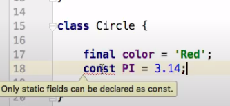
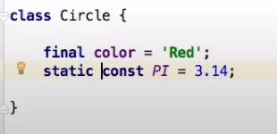

## Dart study notes

 
* 所有的类型 都是对象
* 带;号，所有类型修饰在变量前
* 变量 var 常量 const/final
* 支持类型推断
* if 语句 condition 需要添加()
* 循环语句，跳出关键词没有 fallthrough ，但支持这个功能
* 函数 返回值在前面，没有func关键字，
<!-- more -->
* 函数 支持 => 单行返回的语法（type funcName(type var) => funcBody;）
* 类 属性 默认支持 getter 和 setter 方法
* 类 属性 如果标记 get 则不能赋值（int get value => 2;）
* 有 .? 语法糖，但是没有 int? 语法
* 构造函数和命名构造函数不会被自动继承，需要重写如 ClassName.name(int value) : super( name){};
* 构造函数 可以简写如 ClassName(this.value1, this.value2); 
* 构造函数可以在函数名称中定义变量，但是不能用this如 ClassName(set value) : name = value["name"], super(vale){};
* 支持 单继承，使用extends关键字
* 使用 with 做 mixin，class ClassName extends ClassName1 with Class Name2 {} 
* 任意类都可以被作为接口被实现，使用 implements 实现 
* abstract 定义的抽象类 可以定义未实现的方法
* async await 实现异步操作
* async 定义的方法返回 Future 类型
* async* 定义的方法返回 Stream 类型
* 捕获异常 使用 try on catch finally 关键字，finally一定会运行

* 所有对象默认值是 null
* String 双引号内部使用单引号不用反斜杠，单引号内容使用单引号需要使用反斜杠
* String 可以使用 + 连接
* 字符串内拼接对象可以使用 $var 的方法，非string需要是用${var/表达式} 
* final 只能被设置一次，会在被访问的时候实例化。const是隐式final，但是是运行时常量

* instance variable can be final but cannot be const ( Only static fields can be declared as const)

* ??语法 防止出现null值
* switch  必须有 break 否则会fallthrough
* for 循环 支持for(;;)，for(var name in list){} 没有 0...4的形式
* functions 也是 对象
* 所有的对象都有返回值，默认返回null
* 如果函数标注有返回值，但函数内没有返回则返回默认值null
* function 可选参数  使用[ type name, type name ] 的形式。可选的命名的参数,用花括号{type name, type name} - 调用时，可选参数的顺序可以不用按照定义的顺序
* function 可选参数，设置默认值默认值 type name = ""，必选参数不能有默认值
* try catch 可以获取 stack tree 的值，如catch(e,s)，e代表错误，s代表堆栈
* 自定义 错误 class myException implements Exception { String errorMessage(){ print message };}
* _varname 默认为私有属性
* ~/ truncating division operator，截断出发运算符。如果两个操作数任意一个是double a~/b 等于(a/b).truncate().toInt()
* 类属性 和 类方法 默认lazy
* 闭包可以访问父级变量
* list.forEach( item { print(item); } )

