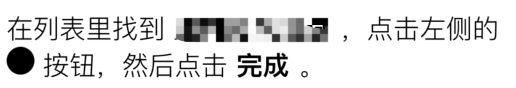
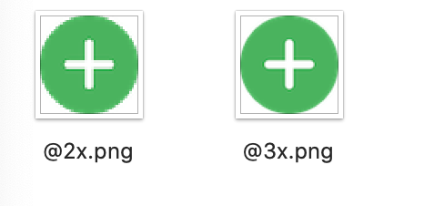

## NSTextAttachment image setup failed
Today I got a problem with my project. When I add an attachment(Image) to an attribute string, the image is not in right form - black filled circle. 

<!-- more -->

As shown below:

But it's original image is: 



And my code is:

```swift
    if let plusRange = text.range(of: "+"), let image = UIImage(named: "name") {
        let attachment = NSTextAttachment(image: image)
        attachment.bounds = CGRect(x: 0, y: 0, width: 19, height: 19)
        let attImage = NSAttributedString(attachment: attachment)
        let loc = text.distance(from: text.startIndex, to: plusRange.lowerBound)
        att.insert(attImage, at: loc)
        att.deleteCharacters(in: NSRange(location: loc + 1, length: 1))
    }
```

I tried several ways to fix it, but did not work. Then I found the definition of the property `image` which shows:

> Image representing the text attachment contents. Modifying this property invalidates -contents, -fileType, and -FileWrapper properties.

So I assigned the image at a new line, like:

```swift
    if let plusRange = text.range(of: "+"), let image = UIImage(named: "name") {
        let attachment = NSTextAttachment()
        attachment.image = image
        ...
    }    
```

It works!

I think Xcode may give a wrong suggestion because I checked the definition of NSTextAttachment. It shows that the convenience init method show up as an extension method in the file of  `UIImage` which belongs `UIKit`. Moreover, ths init method is available in iOS 13.0. And no further information for the method.

So when you gonna to insert a image into an attribute string, you'd better assigning the image by the property `image`.


## Another issue - image baseline
Except last one, there also a layout issue I noticed. After setted, the image will be in a right form. But its baseline is not equal with text. I am very lucky that find the way to solve the issue. As you can see, I change the `y` to `-3`. Becase the value is positive number, image base will be upper than normal. It can be included that the `y` start from bottom to top. 

```swift
    if let plusRange = text.range(of: "+"), let image = UIImage(named: "name") {
        ...
        attachment.bounds = CGRect(x: 0, y: -3, width: 19, height: 19)
        ...
    }
```


