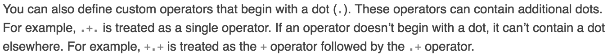
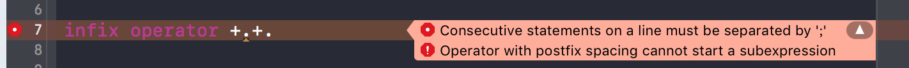

在Swift中，自定义操作符就是简单的二步：首先在全局使用operator关键字来声明操作符，同时用prefix、infix或postfix来声明操作符的位置；然后在所需要的类/结构体中实现操作符。

<!-- more -->

概括一下就是，声明+实现。

自定义操作符需要以两类字符开头：

* ASCII字符中的/, =, -, +, !, *, %, &lt;, &gt;, &amp;, |, ^, ?, ~

如我自己写的正则判断例子

``` swift
	infix operator =~
		
	func =~(str: String, matchs: String) -> Bool {
	    do {
	        return try RegexHelper(matchs).match(str)
	    } catch _ {
	        return false
	    }
	}
```
* Unicode中的Mathematical Operators, Miscellaneous Symbols和Dingbats Unicode blocks这些字符中的字符，然后后面允许使用组合的Unicode字符

如微博①中的例子

``` swift
	infix operator ★+
	
	struct Vector2D {
	    var x: CGFloat
	    var y: CGFloat
	}
	
	extension Vector2D {
	    static func ★+ (left: Vector2D, right: Vector2D) -> Vector2D {
	        return Vector2D(x: left.x + right.x, y: left.y + right.y)
	    }
	}
	
	let vector1 = Vector2D(x: 10, y: 20)
	let vector2 = Vector2D(x: 30, y: 10)
	
	let vector = vector1 ★+ vector2
	
	print(vector)
	
	// 输出结果: Vector2D(x: 40.0, y: 30.0)
```

[参考1](https://developer.apple.com/library/content/documentation/Swift/Conceptual/Swift_Programming_Language/AdvancedOperators.html#//apple_ref/doc/uid/TP40014097-CH27-ID28)

[参考2](https://developer.apple.com/library/content/documentation/Swift/Conceptual/Swift_Programming_Language/LexicalStructure.html#//apple_ref/doc/uid/TP40014097-CH30-ID418)

其中参考2中

意思就是如果以dot(.)开头，运算符后面可以包含dot(.)，如果不是dot(.)开头则不可以再包含dot(.)。

``` swift
	infix operator .+.
	
	struct Vector2D {
	    var x: CGFloat
	    var y: CGFloat
	}
	
	extension Vector2D {
	    static func .+. (left: Vector2D, right: Vector2D) -> Vector2D {
	        return Vector2D(x: left.x + right.x, y: left.y + right.y)
	    }
	}
	
	let vector1 = Vector2D(x: 10, y: 20)
	let vector2 = Vector2D(x: 30, y: 10)
	
	let vector = vector1 .+. vector2
	
	print(vector)
	
	// 输出结果: Vector2D(x: 40.0, y: 30.0)
```
错误如下图


来源：

① [@南峰子_老驴](http://weibo.com/touristdiary?refer_flag=1001030103_) 微博中的 #iOS知识小集# Tag
